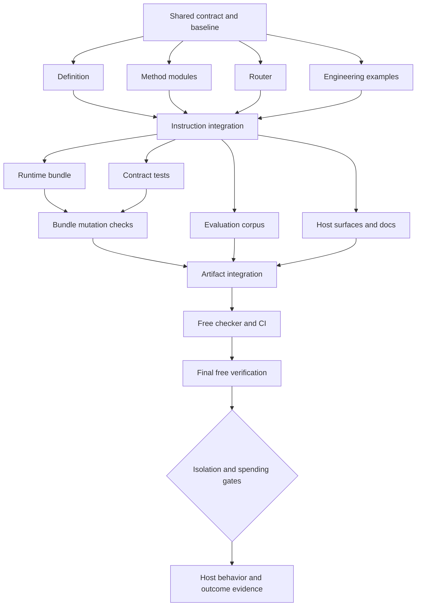

# Ultrasolve Revision Implementation Plan

> **For agentic workers:** REQUIRED: Use superpowers:subagent-driven-development (if subagents available) or superpowers:executing-plans to implement this plan. Steps use checkbox (`- [ ]`) syntax for tracking. The scope and ownership rules below take precedence over generic commit or parallelism suggestions.

**Goal:** Make Ultrasolve's reasoning workflows consistent, respectful of delegated authority, composable across hosts, and ready for outcome evaluation.

**Architecture:** Preserve eight public entrypoints and a single shared corpus. Introduce a shared workflow contract and six reusable method reference modules, then update definition, routing, examples, host surfaces, tests, and evaluation assets through disjoint work packages. Keep model execution separate from free revision work.

**Tech Stack:** Markdown instructions; JSON manifests and evaluation cases; YAML host metadata and CI; Python standard library and unittest for development tooling. No runtime service or model SDK.

---

Execution was approved on 6 September 2026. Checked steps record completed work. Unchecked steps remain outstanding. I2 integrated T5–T8 after producer release and non-author review. The host rejected additional fresh agents at its worker limit, so existing workers reviewed other owners’ work and the orchestrator reviewed their implementations. The receipts identify these review scopes explicitly.

Raw evidence is stored outside the repository at /private/tmp/ultrasolve-revision-hlri7l9o. The source baseline is `a2dcdd9d82653904c98f465fdf4cf06be5e248d6` on `main`, version `0.2.0`. At planning time the checkout was `/Users/matt/src/matt-ramotar/Ultrasolve`. Paths in ownership tables are relative to the executing checkout; commands run from its root. A relocated checkout must work without editing paths.

At the free revision closeout, T0–T10 were complete locally. The corrected entrypoint passed 129 tests on Python 3.9.6. The external 42-file artifact matched the final runtime bytes at that checkpoint. The final status-only document edits receive focused hygiene/link checks. The host/behavior/effectiveness and publication limits remain in [runner feasibility](../../../evals/runner-feasibility.md). T11 remains unchecked and separately gated.

Read the [revision contract](../specs/2026-09-06-ultrasolve-revision-contract.md) first. Its D1–D11 decisions are the common specification. Do not let parallel agents independently choose a different module layout, effort bound, status vocabulary, authority policy, or evaluation format. The prior review is retained at `/Users/matt/.codex/visualizations/2026/09/05/01a0738a-632b-7e80-86c9-d1aeb19a577a/ultrasolve-review.md`; this plan is self-contained if that artifact is unavailable.

**What execution may finish without further permissions**

When the user authorizes this plan, implement and verify T0–T10 locally. Reversible source, test, documentation, and development-tool edits belong to that work. Do not commit, push, publish, install into a personal host configuration, or run a model evaluation. T11 is explicitly conditional on a supported isolation boundary and separately authorized spending. Do not stop free work to request that budget early.

Keep changes in the authorized checkout unless the user requests isolation or other live edits require it. Never create a branch or worktree merely to satisfy a generic skill instruction when filesystem authority does not permit it. If an isolated checkout is needed, record its source revision and preserve user changes. Only the orchestrator handles Git operations.

**Coverage of the twelve review findings**

| Review finding | Required delivery | Owner/task |
|---|---|---|
| R1: native dispatch versus manual commands | Separate public entrypoints from canonical method modules; no denial fallback | T0, T2, T3, T8; runtime proof T11 |
| R2: definition replacing authorized deliverables | Binding decision and effectiveness distinction; conditional requested artifacts; reaffirmation | T1 |
| R3: inherited uncertainty conflicts | One shared contract, preserved by every consumer | T0–T3 |
| R4: inconsistent routing and mandate bounce | One routing table; sufficient operational definition | T1–T3 |
| R5: forced two-form generalization | Applicability check and valid one-sided execution | T2 |
| R6: example correctness | Source-time freshness; unresolved observation window; evidence labels | T1, T4 |
| R7: termination and verification | Independent definition/resolution status; bounded attempts; partial composition | T0, T2, T3 |
| R8: evaluator isolation and rehearsed examples | Runtime allowlist; held-out cases; capability evidence | T6, T7, T10, T11 |
| R9: graders missing outcomes | Invariant-to-criterion coverage and defective-answer calibration | T6 |
| R10: overhead and onboarding | Compact definition; concise result; starter examples; definition starter | T1, T8; loading optimization explicitly deferred |
| R11: phrase-based tests and no CI | Single-owner migration, targeted mutations, free check entrypoint and CI | T5, T9 |
| R12: joint/inconclusive hypotheses | Nonexclusive causes and honest deadline outcomes | T1 |

**Parallel schedule and resource policy**

There are four concurrent slots: one orchestrator and at most three workers. Do not spawn nested workers. Every worker is a bounded current-task subagent, not a new user-owned task. Only the orchestrator writes this plan, the shared spec, integration records, and public documentation. Source owners may suggest changes elsewhere but may not edit another owner's files.

| Stage | Worker slot 1 | Worker slot 2 | Worker slot 3 | Orchestrator work |
|---|---|---|---|---|
| Serial foundation | — | — | — | T0: baseline, freeze, shared runtime contract |
| Wave A | T1: definition | T2: six method modules and entries | T3: router and selection | T4: engineering examples and timing model |
| Integration I1 | Read-only fixes/review as assigned | Read-only fixes/review as assigned | Read-only fixes/review as assigned | Verify the whole instruction graph; reconcile cross-file issues |
| Wave B | T5: legacy tests and contract checks | T6: revised evaluation corpus | T7: runtime bundle | T8: adapters, metadata, onboarding; T10 capability inspection |
| Integration I2 | T5 finishes bundle-dependent mutations after T7 | T6 completes coverage check | T7 resolves integration defects | Confirm source, bundle, fixtures, and metadata agree |
| Wave C | T9: free checker and CI | Fresh read-only spec reviewer | Fresh read-only technical reviewer | Finalize TESTING.md and resolve review findings |
| Serial closeout | — | — | — | T10 final verification, evidence ledger, release-state report |
| Conditional follow-on | Host smoke cases | Behavioral cases after isolation/calibration | Outcome comparison | T11 only after its gates |

Dependency graph:



T5 may write bundle mutation cases in parallel, but cannot execute or claim those cases passed until T7's interface exists. T5's final parity audit and unmodified-copy mutation baseline also wait until T8 declares its wrappers and metadata settled. Integration I2 requires both producer receipts before those checks run. T8 may draft documents early; final claims depend on T5–T10. Independent task-local checks may run concurrently. Full repository suites, native inventory/validation, source/cache operations, and final artifact construction are serialized by the orchestrator. Do not repair or suppress another worker's temporary failure while it owns the relevant file.

Each worker returns: task ID; status; exact changed paths; checks and observed outcomes; first failure and explanation; unresolved claims; proposed cross-owner changes; confirmation of no out-of-scope writes. Save receipts under an external evidence root, one directory per task. Reviewers do not edit. After a task finishes, the orchestrator explicitly transfers ownership back before integrating corrections. Do not blanket-revert another worker's changes.

**T0 — Freeze the contract and capture the baseline. Owner: orchestrator.**

Files: read this plan, the companion spec, README.md, TESTING.md, and all eight current skills. Create only `agent-skills/solve/references/workflow-contract.md` as the runtime foundation. The spec and plan remain orchestrator-owned throughout execution.

- [x] Verify cwd, HEAD, branch, diff, and any additional user authority. If source differs from the pinned baseline, inspect and record the actual delta before proceeding; do not silently reset it.
- [x] Create an evidence directory outside the repository: `ULTRASOLVE_EVIDENCE_ROOT=$(mktemp -d /private/tmp/ultrasolve-revision.XXXXXX)`. Record its path for every worker. Do not modify HOME or CODEX_HOME.
- [x] Run the three baseline commands documented below once, save their outputs, and inventory/hash both v1 evaluation trees. The known review baseline is 40 plugin-contract tests plus 17 portability tests, 57 in discovery; investigate any new failure instead of assuming that baseline still holds.
- [x] Freeze D1–D11 and the exact new file interfaces in this plan. Record that the default is two full method attempts, not two per lens, entrypoint, or subproblem.
- [x] Write the runtime shared reference from D2–D8, retaining all authority, routing, uncertainty, status, evidence, and effort requirements. Keep host-specific syntax and planning/evaluation instructions out of this runtime document.
- [x] Verify the reference is readable and internally consistent. Freeze its bytes for Wave A. Changes requested by a worker return to the orchestrator; a material interface change pauses only affected consumers and triggers a coordinated revision.
- [x] Dispatch T1–T3 with their exclusive scopes, and perform T4 locally.

Baseline commands:

```sh
python3 -m unittest tests.test_plugin_contract -v
python3 -m unittest tests.test_portability_contract -v
python3 -m unittest discover -s tests -p 'test_*.py'
```

No implementation claim follows from this baseline. The new shared reference is not behavioral proof.

**T1 — Definition authority, proportionality, and its example. Owner: definition worker. Depends on T0.**

Exclusive edits: `agent-skills/define/SKILL.md`, `agent-skills/define/references/problem-posing-sources.md`, `agent-skills/define/references/worked-example.md`. Do not edit its Claude wrapper or Codex metadata; send final description/default-prompt recommendations to T8.

- [x] Map the current eight method steps and authored-source descriptions to D3–D7; list which claims need replacement.
- [x] Load/adopt the shared workflow contract from the definition entry. Preserve ordinary-work and evidence-led diagnosis exclusions.
- [x] Replace the automatic artifact-substitution rule with the authority distinction in D5. Preserve supplied binding means while independently questioning their effectiveness. Honor prior reaffirmation and prepare supported conditional work.
- [x] Replace the mandatory full interview with proportional initial output and only material unanswered questions. Keep the deeper record available when warranted.
- [x] Make acceptance parameters individually traceable. Do not invent a named owner or promote an unanswered question to CONFIRMED.
- [x] Add joint-cause and insufficient-evidence dispositions. Do not require causal hypothesis machinery for a noncausal definition request.
- [x] Revise the queue example: preserve the requested artifact when authorized, leave the verification window unresolved, include a joint cause within a symptom class, and end inconclusive evidence honestly. Update every table, question, and handoff template affected by these changes.
- [x] Update source notes only where they describe the revised authored controls; do not expand historical claims.
- [x] Review against A01–A07 and A19 below. Return final frontmatter description and all cross-owner requests.

Acceptance: the open-proposal, binding-decision, and reaffirmed-request cases differ appropriately; existing confirmation answers cannot settle an unspecified observation window; no parallel representation of the shared result/effort policy is introduced.

**T2 — Extract and revise the six canonical methods. Owner: method worker. Depends on T0.**

Exclusive edits: the six leaf `agent-skills/<leaf>/SKILL.md` files. Create the six `agent-skills/solve/references/methods/<leaf>.md` modules, for the exact leaves in D1. Do not edit `agents/openai.yaml`, adapters, the router, worked examples, or tests.

- [x] Inventory every current leaf section and map it to the public entry or method module. Preserve its substance during extraction before applying semantic corrections.
- [x] Keep public name/description frontmatter and a concise boundary/loading body. Load the shared contract and full corresponding module using paths relative to the entrypoint. Require both before any candidate transformation.
- [x] Make modules consume the inherited contract. Modules never restart the stakeholder interview, invoke public commands, or reconstruct original constraints. Use the shared status and effort rules.
- [x] Fix generalize's alternative prerequisites, including result-only, parameterization-only, and both-applicable outcomes. Preserve concrete instantiation and limited shipped scope.
- [x] Qualify Simplify's order-dependent attribution and retain the restoration ledger. Preserve the other method-specific obligations in D8.
- [x] Remove packet-scheduling-specific corrective prose from the generic analogy method; identify anything T4 must preserve in the existing analogy example. Retain the generic fact-verification and mismatch rules.
- [x] Return each module's original-criterion map-back obligations and the canonical paths needed by T3/T7. Confirm exactly one full body per method.
- [x] Review against A08–A13 and all twelve transfer fixtures. Return final descriptions to T8 without editing metadata.

Acceptance: six direct entrypoints and router composition read the same six complete modules; one-sided generalization invents no missing prerequisite; method extraction does not drop a constraint, safety distinction, or provenance qualifier.

**T3 — Router, dispatch, bounded iteration, and selection reference. Owner: router worker. Depends on T0.**

Exclusive edits: `agent-skills/solve/SKILL.md` and `agent-skills/solve/references/technique-selection.md`. Treat the shared workflow reference as frozen input; do not edit it. Do not edit leaf entries, modules, wrappers, or metadata.

- [x] Make State adopt the shared problem contract and its sufficient-definition rule. Remove the extra mandate requirement from technique selection.
- [x] Replace native-command dispatch with permitted loading of canonical method modules. Never use a public leaf command or public leaf entrypoint as internal fallback.
- [x] Specify the eighteen-resource preflight in D2, all missing-resource reporting, and full selected-module loading before cheap candidates.
- [x] Preserve one-to-three cheap comparisons and one full execution first. Implement the shared two-attempt default without resetting it on handoff or subproblem composition.
- [x] Make every full execution end in a map-back checkpoint whose outcome can be partial. Carry original obligations into any next method; distinguish whole-result verification from a successful subproblem.
- [x] Add the shared resolution status and evidence summary to the result. Return useful unresolved work at the effort bound without a routine permission prompt.
- [x] Review routing and combinations against A06, A08, A12–A18. Return the final solve description to T8.

Acceptance: no loader-policy contradiction, no mandate bounce, no unbounded relabel-and-retry loop, no requirement that a first method solve the whole problem before a second can address its remaining seam.

**T4 — Correct engineering examples and check the timing argument. Owner: orchestrator. Parallel with T1–T3.**

Exclusive edits: `agent-skills/solve/references/worked-examples.md`. Create `tests/test_example_models.py`. This test file remains orchestrator-owned; T5 must not edit it without an explicit transfer.

- [x] Distinguish fictional inputs, illustrative deductions, and proposed verification in the examples. Preserve useful technical depth without making new measured-performance claims.
- [x] Correct the cache lease using D9. State the coverage-time and clock assumptions before the bound. Remove any implication that consumers instantly detect an unpublished upstream commit.
- [x] Write a small deterministic timing model inside the new test file. Model source coverage 0, write 0.1, delivery 1.9, a five-second budget, expiry at 5.0 before clock margin, and rejection of expired replay. Include nonzero clock uncertainty and an unknown-bound case that cannot claim proof.
- [x] First encode the receipt-renewal rule as the counterexample and observe the failed timing obligation; retain that red evidence outside the repository. Then assert the corrected conservative model and compare its reasoning with the prose. The test verifies a model of the example, not a deployed cache.
- [x] Keep required DRR facts in the existing analogy example when T2 removes them from generic instructions. Do not introduce another runtime reference file without amending the frozen inventory.
- [x] Align examples with shared statuses and partial composition. Audit every statement resembling an executed test or measurement.
- [x] Run `python3 -m unittest tests.test_example_models -v`; expect all model cases to pass. Return the exact assumptions and limits in the receipt.

**Integration I1 — Freeze the revised instruction graph. Owner: orchestrator.**

- [x] Wait for all Wave A writers to finish and return ownership. Check changed paths against assignments before editing.
- [x] Review each package against the spec first, then for technical quality. Reuse idle reviewers for bounded read-only checks; never exceed three workers.
- [x] Verify public-entry → shared-contract → method-module paths, eighteen preflight resources, one body per method, the definition example, and source-note parity.
- [x] Resolve shared-contract changes centrally, notifying every affected owner. Save the integrated tree hash and receipts. Do not commit as an integration mechanism.
- [x] Record expected legacy assertion failures caused by the approved design changes. Do not weaken tests to hide unrelated failures. The instruction revision is not complete until T5 migrates and validates those contracts.
- [x] Dispatch T5–T7. Begin T8 and the read-only portion of T10.

**T5 — Migrate structural contracts and add targeted mutations. Owner: test worker. Depends on I1; bundle mutations also depend on T7.**

Exclusive edits: `tests/test_plugin_contract.py`, `tests/test_portability_contract.py`. Create `tests/__init__.py`, `tests/contract_support.py`, `tests/test_contract_mutations.py`. No other worker edits these files. The legacy suites intentionally have one owner because their meta-test couples test names across files.

- [x] Produce an external coverage-disposition table mapping every existing test/obligation to retained, replaced, or retired coverage, with a reason. Preserve packaging, identity, provenance, resource, policy, and hygiene protections.
- [x] Separate runtime/public-document semantic scanning from whole-repository text hygiene and link checking. Development plans and evaluator material remain under hygiene; both `.yaml` and `.yml` are covered.
- [x] Replace superseded phrase assertions for native loading, both-form generalize, fixed interviews, old reference locations, inherited state, and result completion. Retain literal checks for real interface paths, names, versions, and flags.
- [x] Replace the exact legacy-test-name migration requirement with explicit coverage obligations. Do not silently delete its protection against dropped contracts.
- [x] Add pure `audit_runtime_contract(root: Path) -> list[dict]` in contract_support. Each issue has `code`, `path`, and `message`. Use stable codes: `ENTRYPOINT_SET`, `WRAPPER_TARGET`, `ACTIVATION_POLICY`, `DESCRIPTION_PARITY`, `VERSION_PARITY`, `RESOURCE_MISSING`, `METHOD_BODY_DUPLICATED`. Audit actual files; a declared policy registry alone is not proof.
- [x] Refactor the relevant existing checks to use root-parameterized helpers where needed. Do not build a prose-semantic validator or a general Python/YAML framework.
- [x] Mutate temporary copies only. First verify the unmodified copy passes. Each wrong wrapper target, activation flag, description mismatch, version mismatch, missing module/shared resource, or duplicated full body must fail its intended obligation. A harmless explanatory paraphrase must remain acceptable.
- [x] After T7 exists, add bundle checks through its public function for a prohibited allowlist entry, unsafe path, missing dependency, and symlink. Assert the intended error, not an incidental failure.
- [x] Run the two legacy suites and mutation suite locally. Save first failures and corrected results. Do not skip or xfail cases because a sibling task is unfinished; defer that dependent run until its producer finishes.

Acceptance: obsolete behavior is no longer required, important structural regressions are still detected, all removed assertions have a disposition, and textual checks are not reported as observed model behavior.

**T6 — Author v2 cases, outcome criteria, and calibration answers. Owner: evaluation worker. Depends on I1.**

Create only `evals/portable/v2/cases.json`, `evals/portable/v2/rubrics.md`, `evals/portable/v2/grader-calibration.json`, and `tests/test_evaluation_contract.py`. Both v1 trees remain unchanged. Do not implement a native evaluator or run a model.

- [x] Encode A01–A20 and M01–M12 below as exact stimuli, not summaries. Expand parameterized cases explicitly. A multi-turn case stores the exact messages and the observation that releases each next turn.
- [x] Use a JSON envelope with `schema_version: 2` and `cases`. Each case has a unique `id`, `family`, `evaluation_class` (`routing`, `regression`, `transfer`, or `integration`), `setup`, `turns`, `supplied_facts`, `invariants`, `expected_route`, `expected_definition_status`, `allowed_resolution_statuses`, `criteria`, and `forbidden_claims`. Integration setups describe required capabilities; they do not invent host flags.
- [x] Give every invariant a stable ID. Each criterion has `id`, `category` (`invocation`, `method`, `outcome`, or `utility`), `invariant_ids`, `rubric_id`, and `required`. Every invariant maps to at least one required outcome criterion. Criterion categories remain separate in reporting.
- [x] Write exact rubric definitions with pass/fail examples. Method vocabulary cannot substitute for preserving constraints; avoid graders that accept “verified” merely because the answer says so.
- [x] Author calibration answers: a label-perfect merge that destroys rollback/history; an invented benchmark result; a concise correct baseline without method labels; a correct answer with wrong automatic activation; valid one-sided generalize; and a correct conditional draft. Record expected criterion labels as authored expectations, not measured judge accuracy.
- [x] Make tests validate unique IDs, case completeness, rubric references, invariant coverage, turn structure, and required families. They must not award semantic pass scores to the calibration answers.
- [x] Inspect the runtime examples and remove task-equivalent answers from the transfer set. Preserve each changed constraint that makes simple copying incorrect. Label public held-out cases as held out from this plugin's examples, not confidential or guaranteed unseen by model training.
- [x] Run `python3 -m unittest tests.test_evaluation_contract -v`. Confirm both v1 tree hashes match T0. Return a coverage matrix and any outcome requiring unavailable runtime evidence.

**T7 — Build a reproducible evaluation runtime bundle. Owner: bundle worker. Depends on I1.**

Create only `tools/eval_bundle.py`, `evals/runtime-files.json`, and `tests/test_eval_bundle.py`. Do not own the final free checker or CI. No host, network, installer, or model calls from this tool.

New interfaces to implement:

```text
python3 tools/eval_bundle.py --source <checkout> --output <new-directory> --manifest-output <outside-bundle-file>
build_bundle(source: Path, output: Path, manifest_output: Path) -> dict
```

The angle-bracket arguments describe caller-supplied paths; they are not host CLI flags or unfinished implementation choices. `evals/runtime-files.json` contains `schema_version: 1` and an explicit sorted `files` array for the 42 files in D10; no globs.

Expose `BundleError(ValueError)` with a stable `code` attribute and a readable message. The codes are `ALLOWLIST_INVALID` for malformed, duplicate, or prohibited entries; `SOURCE_MISSING`; `SOURCE_SYMLINK`; `DESTINATION_INVALID` for unsafe, nonempty, or incorrectly nested output/manifest destinations; `RESOURCE_MISSING` for a broken required runtime reference; and `COPY_FAILED` for a copy/write failure. The CLI exits 2 for these rejected builds and emits no completed manifest. T5 asserts these codes rather than matching incidental wording. Other unexpected failures remain nonzero errors and must not be disguised as successful validation.

- [x] Write tests for the allowlist and output contract before implementation. Expect missing implementation to fail, then build the minimal standard-library tool.
- [x] Reject duplicate normalized paths, traversal, absolute allowlist entries, unexpected symlinks in source paths, missing inputs, source-contained output/manifest destinations, and nonempty output destinations. Resolve paths before the containment check. Never delete an existing destination to make a build succeed.
- [x] Validate the complete input set before copying. Preserve exact bytes. A failure must not leave an artifact labeled complete; clean up only temporary files created by this invocation or mark the output incomplete.
- [x] Emit an external manifest with schema version, sorted paths, byte sizes, per-file SHA-256, source revision when available, dirty state, and aggregate content hash. The content hash excludes location, time, Git availability, and dirty-state metadata so identical bytes produce the same content identity. Missing Git metadata is explicit `unknown`, not an invented revision.
- [x] Verify all mandatory runtime references resolve within the bundle. Exclude all development/evaluator surfaces, including this plan/spec. Do not copy README.md or TESTING.md into this evaluation artifact.
- [x] Test two identical builds, relocated source paths with spaces, missing required references, existing or incomplete output destinations, prohibited eval/test/doc entries, and symlink/traversal cases. Use temporary directories. Bundle expiration is not a concept in this interface.
- [x] Run `python3 -m unittest tests.test_eval_bundle -v`. Return the 42-file inventory and helper contract to T5/T9.

Acceptance: deterministic artifact identity, safe fresh output, full runtime dependency closure, and explicit “bundle composition verified” wording. The tool never claims that an agent cannot read the original checkout.

**T8 — Align host surfaces and user-facing documents. Owner: orchestrator. Depends on I1; final documentation also depends on I2/T9/T10.**

Exclusive edits: all eight `adapters/claude/skills/<name>/SKILL.md`; all eight `agent-skills/<name>/agents/openai.yaml`; interface fields only in `.codex-plugin/plugin.json`; README.md, PRIVACY.md, TESTING.md. Preserve other manifest fields and all version numbers. No worker may opportunistically edit these files.

- [x] Copy final canonical descriptions into Claude wrappers where parity is required. Retain their thin delegation and all six manual flags. Do not widen tool permissions.
- [x] Align Codex descriptions/default prompts with final behavior while preserving two true/six false implicit flags and existing discoverable identities.
- [x] Add a definition starter to the three plugin starters, retaining solve and one explicit method example. Make the starters use actual exposed skill names and supply a useful input shape.
- [x] Lead README with a concise example and a problem/success/constraints/attempts/evidence input template. Explain public commands, router-owned method composition, conditional outcomes, and reaffirmation. Retain supported installation instructions and publication hold.
- [x] Explain that privacy/runtime behavior remains static instructions; the new bundle/check utilities are development tooling that never auto-run in a host session.
- [x] Draft TESTING.md around the free entrypoint, bundle proof, unchanged historical v1 cases, new v2 corpus, per-host evidence states, and paid-run gates. Remove the old copy recipe as the claimed isolation boundary. Do not manipulate HOME or CODEX_HOME in new examples.
- [x] Keep current installation evidence separate from the future allowlisted evaluation artifact. Revisit any fresh-install recipe that depends on changing a personal configuration root only when a supported isolated interface is verified; otherwise mark that check unperformed.
- [x] Perform final parity review after T9/T10. Ensure no current behavioral reliability, public availability, or measured performance claim was introduced.


**T9 — One free verification entrypoint and CI. Owner: verification worker. Depends on I2.**

Create only `tools/check.py` and `.github/workflows/verify.yml`. Do not edit legacy tests or public documentation; send exact usage to the orchestrator.

New interface: `python3 tools/check.py`, no required options, no model or host invocation. Run checks sequentially and exit nonzero if any required check fails. Discover the repository from the script location so caller cwd does not determine the target.

- [x] Run unittest discovery for all maintained test modules, including model, corpus, bundle, and mutation checks. Parse the four manifests and apply repository-wide maintained-text hygiene and link checks through existing tests; avoid duplicating their implementation in the tool.
- [x] Report an explicit list of executed checks and their status. Missing optional host tools are outside this command, never silently counted as passes. Save useful failure output; do not auto-retry a failing suite.
- [x] Configure CI to run the same free entrypoint on Linux and macOS with Python 3.11. Resolve supported official checkout/Python actions and pin their immutable commit SHAs, recording the corresponding version in comments. No publish, paid model, or personal installation step.
- [x] Give CI read-only repository permissions, a job timeout, and no credentials beyond the platform's normal read token. Do not claim hosted CI passed until a run exists for the actual revision.
- [x] Run the entrypoint locally once after integration. Return commands, results, and the final workflow for root review.

**T10 — Capability record, final audit, and free-work closeout. Owner: orchestrator.**

Create `evals/runner-feasibility.md`. This is the only new repository evidence-status document in this plan; raw logs and generated bundles remain outside the checkout.

- [x] During Wave B, inspect installed host versions and read-only help/validation interfaces. Do not start any agent/model process merely to inspect behavior. Record observed, documented, inferred, and unavailable capabilities separately.
- [x] For Claude and Codex, record independent fixture/runtime roots, real filesystem restriction options, full trace availability, model pinning, cost limits, failure reporting, and whether starting a run itself incurs charges. If a capability is unsupported, say so. Do not invent a flag or build a runner around an inferred interface.
- [x] After T9 and final documentation, run `python3 tools/check.py` on the integrated tree; run `git diff --check -- .`; verify v1 hashes and changed-file ownership. Account for the planning documents separately from implementation changes.
- [x] If Claude is available, run the read-only checks below and record the exact version. If unavailable, record them as unperformed and finish unaffected free work. These checks do not call an agent model.
- [x] Build one final runtime artifact using a fresh external output directory. Verify its manifest, content hash, dependency closure, and absence of evaluator/development files. Optional native validation of this artifact proves packaging only.
- [x] Complete read-only reviews for spec compliance and technical quality. Fresh-agent dispatch was rejected by the host limit; reused non-author workers and root reviews supplied the recorded coverage. Resolve material findings centrally; re-run only checks affected by changes. Do not repeat unrelated passing checks without a reason.
- [x] Finish receipts and the coverage-disposition table. Report FREE-REVISION-READY only when all required local source/test/artifact criteria pass. Mark each host's behavioral status and effectiveness status separately; do not mark T11 complete.

Read-only host checks, where installed:

```sh
claude --version
claude plugin validate .claude-plugin/marketplace.json --strict
claude plugin validate .claude-plugin/plugin.json --strict
claude --plugin-dir . plugin details ultrasolve
claude plugin eval --help
codex --version
codex plugin --help
```

Portable validators and plugin-eval static analysis are optional supplementary checks. Resolve their installed paths; retain raw findings and interpret heuristic scores. They are not substitutes for the required free suite or proof of effectiveness.

**Acceptance case inventory for T6 and the reviewers**

| ID | Exact scenario to author | Falsifiable expectation |
|---|---|---|
| A01 | Open migration proposal with unresolved outcome | Define compares options and preserves the actual delegated artifact |
| A02 | Binding technology decision; delivery-planning responsibility only | Produce supported conditional plan without reopening the binding choice |
| A03 | Two-turn definition challenge followed by explicit reaffirmation | Proceed on turn two; no repeated approval gate |
| A04 | Small decision-recording problem with one missing definition | Compact provisional definition and only material questions |
| A05 | Multi-owner contested outcome, explicit request for deep definition | Expand appropriately without inventing answers |
| A06 | Agreed operational criteria, unknown business rationale, three failed designs | Solve directly; no mandate/definition bounce |
| A07 | Only joint deployment-plus-peak-load reproduces a stall; deadline before causal separation | Retain joint/inconclusive outcome and authorized conditional next step |
| A08 | Same inherited contract under CONFIRMED, OPEN, and ASSUMED, through all six methods | Expand to eighteen cases; preserve owner/question/non-goals/status and remaining budget |
| A09 | Undefined onboarding difficulty versus pure ideation, through every direct leaf, brainstorming available | Expand to twelve cases; definition versus ideation routing is consistent |
| A10 | Result-only, parameterization-only, and both-applicable generalize | Expand to three cases; no invented prerequisites |
| A11 | Two constraints separately feasible but jointly contradictory, restored in both orders | Attribute the interaction, not different sole causes |
| A12 | Decompose finds a seam requiring analogize | Partial checkpoint preserves original obligations; second full method consumes remaining attempt |
| A13 | No runnable target but a plausible design and detailed test plan | CANDIDATE or PARTIAL; no fabricated executed check |
| A14 | Two different full attempts fail to yield a solution; re-entry offered | Stop default exploration without resetting budget or false infeasibility |
| A15 | Derivable contradiction in fixed constraints | INFEASIBLE with premises; search exhaustion alone would not suffice |
| A16 | Missing nonselected module and missing shared reference | One integrity error before candidates; list all missing resources |
| A17 | Native loader absent; permitted file reads present | Router uses method resources without requiring a native command loader |
| A18 | Host/user explicitly denies a selected method or required resource | End the prohibited path; no alias, copy, relocated module, or alternate loader |
| A19 | Sponsor answers old example questions but supplies no observation window | Window remains unresolved; definition cannot become fully confirmed |
| A20 | Ordinary clamp task, single failed attempt, and reproducible evidenced diagnosis | Expand to three cases; no inappropriate solve activation |

Author these as stable ID expansions, for example `A08-open-simplify`. The specification requires 52 expanded A cases: A08 contributes 18, A09 contributes 12, A10 contributes 3, A20 contributes 3, and the other sixteen IDs contribute one each. Together with M01–M12, the v2 inventory contains 64 cases. T6 must verify the actual enumeration and report any discrepancy instead of silently omitting coverage.

Transfer cases are held out from the shipped worked examples. Supply enough facts to make the intended reasoning assessable; do not require unsupported research claims.

| IDs | Method | Two different problems to develop |
|---|---|---|
| M01–M02 | Simplify | Museum staffing with two interacting coverage rules; offline editor sync with a nonrelaxable data-retention rule |
| M03–M04 | Analogize | Instrument-booking allocation with supplied reservation mechanics; delayed environmental samples where a tempting queue analogy violates sample stability |
| M05–M06 | Restate | Accessibility navigation ordering with unchanged keyboard reachability; lab handoff delays with fixed staffing and deadlines |
| M07–M08 | Generalize | Broaden a supplied validated access-rule result without a useful parameter axis; parameterize a geometric tiling special case without a supplied solved precedent |
| M09–M10 | Decompose | Archive digitization with provenance and completeness across stages; permission-preserving search-index replacement with a cross-stage revocation obligation |
| M11–M12 | Invert | Exhibition opening with irreversible fabrication steps; release-readiness recovery where necessary approvals are not sufficient for correctness |

These twelve fixtures must not merely rename entities from the six worked examples. Each includes an altered constraint or inference trap and an outcome-based rejection condition. Direct-invocation baseline tasks remove only plugin-specific invocation syntax; they retain the same substantive problem.

**T11 — Conditional runtime and effectiveness evidence. Owner: orchestrator after free closeout.**

T11 is not executable until the actual runner interface and filesystem restriction mechanism are verified and the user explicitly authorizes the model/judge budget. The current plan does not authorize spending. If no supported runner exists, leave this phase unperformed with a precise capability gap; the free revision may still be ready. Author a separate bounded runner-integration task only after inspecting a real supported interface.

- [ ] Present a concrete run manifest: immutable source/bundle/case hashes, host versions, exact agent and judge model IDs, allowed tools, filesystem access boundary, case IDs, repetitions, arms, and requested cost ceiling. No moving model aliases.
- [ ] Establish access evidence that legitimate runtime files are readable while original checkout, tests, graders, results, and equivalent relative/symlink routes are inaccessible. Bundle contents alone cannot pass this gate.
- [ ] Verify public explicit leaf invocation and automatic router composition separately on each supported host. The router trace must load the shared contract and full module before applying it, with no public-leaf command invocation. If the host prohibits the composition, stop that host path and revise the design openly.
- [ ] Run a one-repetition diagnostic pilot for each major family, plus judge calibration. Capture full events and failure/abort records. Correct a defective fixture by issuing a new version, not rewriting evidence in place.
- [ ] Execute approved matched comparisons: base agent, base agent plus a short problem/constraints/evidence reminder, and full plugin. Randomize order, blind outcome judgments where feasible, and keep all substantive task inputs equivalent.
- [ ] Repeat critical routing/authority/status/denial cases according to the approved manifest; require every mandatory criterion for each required complete run. Set later caps from observed pilot costs and explicit headroom.
- [ ] Report invocation compliance, method compliance, outcome correctness, overrides, latency, and cost separately. Qualify small samples; exact-prompt repeatability is not broad precision/recall or general effectiveness.

T11 completion claims name the exact host/version, tasks, models, and evidence bundle. A blocked runner or missing spending authorization never becomes a passing runtime result.

**Dispatch packet to copy for each implementation worker**

```text
Implement task <task ID> from docs/superpowers/plans/2026-09-06-ultrasolve-revision-plan.md.
Read docs/superpowers/specs/2026-09-06-ultrasolve-revision-contract.md first.
The source baseline and integrated prerequisites are recorded in the root receipt.
Your only writable files are the exclusive files listed under your task.
All other files are read-only. Do not spawn agents, change public APIs beyond
the spec, edit shared tests/docs, commit, push, install, or run model evaluations.
Use the exact shared module paths, statuses, authority rules, and effort bound.
Run your task-local checks; leave cross-task checks to the integration owner.
For a cross-owner issue, send the proposed change and evidence to the orchestrator.
Return task status, changed paths, checks/results, first failures, unresolved
claims, and cross-owner requests. Do not claim unexecuted behavior passed.
```

The orchestrator fills the task ID, evidence directory, verified checkout, and any authorized scope adjustment before dispatch. Task-specific file ownership takes precedence over a generic skill's suggestion to make a commit or edit a convenient neighboring file.

Before execution, a fresh independent reviewer approved the task decomposition, ownership, four-slot schedule, free/conditional phase separation, and inventory arithmetic. Its advisory clarifications about metadata readiness, bundle error codes, and incomplete destinations are incorporated above. All 57 existing tests passed with these planning documents present. That earlier check validated the planning artifacts only. Implementation evidence is recorded in the checked steps and external receipts above. Behavioral evaluation remains unperformed.
